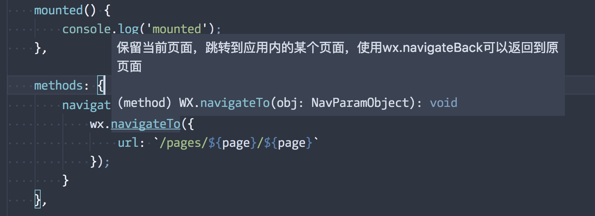

## miniprogram-types

Typings for miniprogram with mpvue

## Usage

```js
import { wx, getApp } from 'miniprogram-types';

wx.navigateTo({
    url: ''
});

const app = getApp();
```

## ScreenShot


